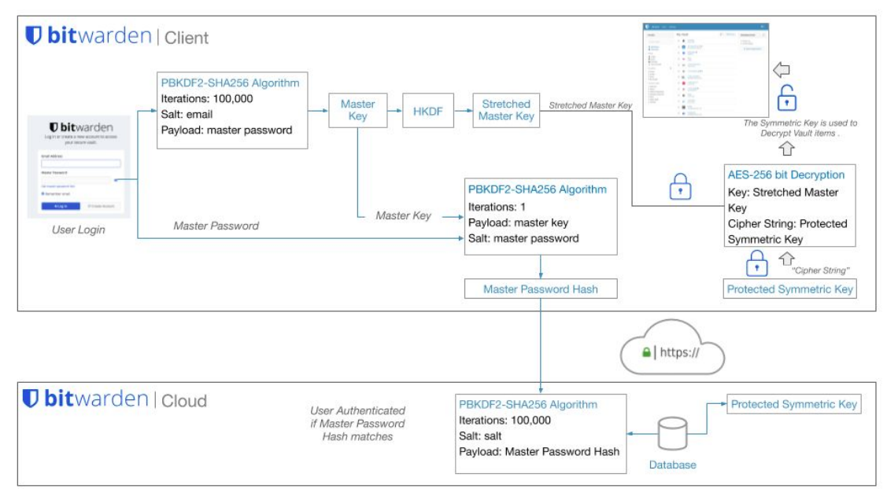

# Password Managers  
It seems like everything requires a password nowadays. We use them for home Wi-Fi, social networks, bank accounts, business emails, and our favorite applications and websites. According to a [study conducted by NordPass](https://www.techradar.com/news/most-people-have-25-more-passwords-than-at-the-start-of-the-pandemic), the average person now has around 100 passwords. This is one of the main reasons people often reuse passwords or create overly simple ones.  
Given this reality, we need to have strong, unique passwords for each service. Yet, it is unrealistic to expect anyone to memorize hundreds of complex credentials. This is where a [password manager](https://en.wikipedia.org/wiki/Password_manager) becomes essential. A password manager is an application that securely stores passwords and sensitive information in an encrypted database. In addition to keeping data safe, password managers offer features such as password generation, two-factor authentication (2FA) support, secure form filling, browser integration, multi-device synchronization, security alerts, and more.  
Given this reality, we need to have strong, unique passwords for each service. Yet, it is unrealistic to expect anyone to memorize hundreds of complex credentials. This is where a [password manager](https://en.wikipedia.org/wiki/Password_manager) becomes essential. A password manager is an application that securely stores passwords and sensitive information in an encrypted database. In addition to keeping data safe, password managers offer features such as password generation, two-factor authentication (2FA) support, secure form filling, browser integration, multi-device synchronization, security alerts, and more.  
## How does a password manager work?  
The implementation of password managers varies by provider, but most operate using a master password to encrypt the password database.  
The Encryption and authentication rely on us [cryptographic hash functions](https://en.wikipedia.org/wiki/Cryptographic_hash_function) and [key derivation functions](https://en.wikipedia.org/wiki/Key_derivation_function) to prevent unauthorized access to the encrypted database and its content. The specific mechanisms used depend on the provider and whether the password manager is cloud-based or locally stored.  
Let's break down some common password managers and how they work.  
## Cloud password managers  
One of the key considerations when choosing a password manager is convenience. The average person owns three or four devices and uses them to log into different websites and applications. A cloud-based password manager allows users to synchronize their encrypted password database across multiple devices. Most of them provide:  
* A mobile application.  
* A browser add-on.  
* Some other features that we'll discuss later in this section.  
Each password manager vendor implements security in their own way, and usually provide a technical document detailing how their system works. You can refer to the whitepapers from [Bitwarden](https://bitwarden.com/images/resources/security-white-paper-download.pdf), [1Password](https://1passwordstatic.com/files/security/1password-white-paper.pdf), and [LastPass](https://assets.cdngetgo.com/da/ce/d211c1074dea84e06cad6f2c8b8e/lastpass-technical-whitepaper.pdf) as examples (though many others exist). Let's take a look at how these systems generally work.  
A common implementation for cloud password managers involves deriving encryption keys from the master password. This approach supports [Zero-Knowledge Encryption](https://blog.cubbit.io/blog-posts/what-is-zero-knowledge-encryption), which ensures that no one, not even the service provider, can access your secured data. To illustrate this, let's examine Bitwarden's approach to password derivation:  
A common implementation for cloud password managers involves deriving encryption keys from the master password. This approach supports [Zero-Knowledge Encryption](https://blog.cubbit.io/blog-posts/what-is-zero-knowledge-encryption), which ensures that no one, not even the service provider, can access your secured data. To illustrate this, let's examine Bitwarden's approach to password derivation:  
* Master key: Derived from the master password using a key derivation function.  
* Master password hash: Generated using the master password (and often the master key) to authenticate the user to the cloud service.  
* Decryption key: Created using the master key to form a symmetric key, which is then used to decrypt vault items.  
  
This is a simplified explanation of how password managers operate. In practice, the implementation is more complex. For deeper insight, refer to the technical documents linked above or watch the [How Password Managers Work – Computerphile](https://www.youtube.com/watch?v=w68BBPDAWr8) video.  
Some of the most popular cloud password managers are:  
* [1Password](https://1password.com/)  
* [Bitwarden](https://bitwarden.com/)  
* [Dashlane](https://www.dashlane.com/)  
* [Keeper](https://www.keepersecurity.com/)  
* [Lastpass](https://www.lastpass.com/)  
* [NordPass](https://nordpass.com/)  
* [RoboForm](https://www.roboform.com/)  
## Local password managers  
Some companies and individuals prefer to manage their own security for various reasons, opting not to rely on third-party services. Local password managers provide this option by storing the password database locally and placing the responsibility on the user to protect its content and storage location. [Dashlane](https://www.dashlane.com/) published a blog post, [Password Manager Storage: Cloud vs. Local](https://blog.dashlane.com/password-storage-cloud-versus-local/), which explores the pros and cons of each approach. As the blog states, "At first it might seem like this makes local storage more secure than cloud storage, but cybersecurity is not a simple discipline." This post serves as a useful starting point for understanding which method may better suit different password management scenarios.  
Local password managers use encryption methods similar to those of cloud-based implementations. The most notable difference lies in data transmission and authentication. To encrypt the database, local password managers focus on securing the database stored on the local system, using various cryptographic hash functions (depending on the manufacturer). They also employ key derivation functions with random salt to prevent precomputed keys and to hinder dictionary and guessing attacks. Some offer additional protections such as memory protection and keylogger resistance, using a secure desktop environment similar to Windows User Account Control (UAC).  
Some of the most widely used local password managers are:  
* [KeePass](https://keepass.info/)  
* [KWalletManager](https://apps.kde.org/kwalletmanager5/)  
* [Pleasant Password Server](https://pleasantpasswords.com/)  
* [Password Safe](https://pwsafe.org/)  
## Features  
Let's imagine we use Linux, Android, and Chrome OS. We access our applications and websites from multiple devices and want to synchronize all passwords and secure notes across them. We also need extra protection through 2FA, and our budget is $5 per month. This information can help us identify the most suitable password manager for our needs.  
When choosing between a cloud or local password manager, it's important to understand the available features. [Wikipedia](https://en.wikipedia.org/wiki/List_of_password_managers) offers a helpful list of both online and offline password managers, along with their key capabilities. Here are some of the most common features:  
* [2FA](https://authy.com/what-is-2fa/) support.  
* Multi-platform (Android, iOS, Windows, Linux, Mac, etc.).  
* Browser Extension.  
* Login Autocomplete.  
* Import and export capabilities.  
* Password generation.  
## Alternatives  
Passwords are the most common form of authentication, but not the only one. As we've seen throughout this module, passwords can be compromised in many ways: cracking, guessing, shoulder surfing, and more. But what if we didn't need passwords at all? Is that even possible?  
By default, most operating systems and applications are built around password based authentication. However, administrators can adopt third-party identity providers or applications to enhance identity protection. Some of the most common alternatives include:  
* [Multi-factor Authentication (MFA)](https://en.wikipedia.org/wiki/Multi-factor_authentication)  
* [FIDO2](https://fidoalliance.org/fido2/), an open authentication standard that enables passwordless logins using physical devices like [YubiKey](https://www.yubico.com/). For a broader list of devices, see [Microsoft’s supported FIDO2 providers](https://docs.microsoft.com/en-us/azure/active-directory/authentication/concept-authentication-passwordless#fido2-security-key-providers).  
* [One-Time Passwords (OTP)](https://en.wikipedia.org/wiki/One-time_password)  
* [Time-Based One-Time Passwords (TOTP)](https://en.wikipedia.org/wiki/Time-based_one-time_password)  
* [IP restrictions](https://news.gandi.net/en/2019/05/using-ip-restriction-to-help-secure-your-account)  
* Device compliance enforcement via tools like [Microsoft Endpoint Manager](https://www.petervanderwoude.nl/post/tag/device-compliance/) or [Workspace ONE](https://www.loginconsultants.com/enabling-the-device-compliance-with-workspace-one-uem-authentication-policy-in-workspace-one-access)  
## Going passwordless  
Many companies—including [Microsoft](https://www.microsoft.com/en-us), [Auth0](https://auth0.com/), [Okta](https://www.okta.com/), and [Ping Identity](https://www.pingidentity.com/en.html)—are advocating for a [passwordless](https://en.wikipedia.org/wiki/Passwordless_authentication) future. This strategy aims to remove passwords as an authentication method altogether.  
[Passwordless](https://www.pingidentity.com/en/resources/blog/posts/2021/what-does-passwordless-really-mean.html) authentication is achieved when an authentication factor other than a password is used. A password is a knowledge factor, meaning it's something a user knows. The problem with relying on a knowledge factor alone is that it's vulnerable to theft, sharing, repeat use, misuse, and other risks. Passwordless authentication ultimately means no more passwords. Instead, it relies on a possession factor (something a user has) or an inherent factor (something a user is) to verify user identity with greater assurance.  
[Passwordless](https://www.pingidentity.com/en/resources/blog/posts/2021/what-does-passwordless-really-mean.html) authentication is achieved when an authentication factor other than a password is used. A password is a knowledge factor, meaning it's something a user knows. The problem with relying on a knowledge factor alone is that it's vulnerable to theft, sharing, repeat use, misuse, and other risks. Passwordless authentication ultimately means no more passwords. Instead, it relies on a possession factor (something a user has) or an inherent factor (something a user is) to verify user identity with greater assurance.  
As new technology and standards evolve, we need to investigate and understand the details of their implementation to determine whether those alternatives will provide the security we need for the authentication process. You can read more about Passwordless authentication and different vendor strategies:  
* [Microsoft Passwordless](https://www.microsoft.com/en-us/security/business/identity-access-management/passwordless-authentication)  
* [Auth0 Passwordless](https://auth0.com/passwordless)  
* [Okta Passwordless](https://www.okta.com/passwordless-authentication/)  
* [PingIdentity](https://www.pingidentity.com/en/resources/blog/posts/2021/what-does-passwordless-really-mean.html)  
There are many options available for protecting passwords. Choosing the right one depends on the specific needs of the individual or organization. It is common for both people and companies to use different password protection methods for different purposes.  
