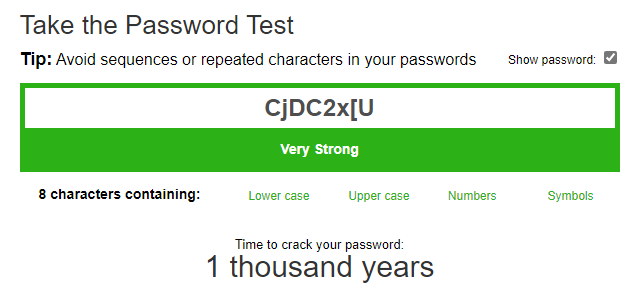
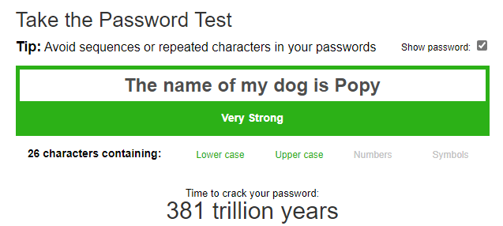

# Password Policies  
Now that we have worked through numerous ways to capture credentials and passwords, let us turn our attention to best practices for password and identity protection. Speed limits and traffic laws exist so that we drive safely. Without them, driving would be chaotic. The same is true when a company does not have proper policies in place; users could act without constraints regardless of the consequences. This is why service providers and administrators define and enforce policies for better security.  
Let us meet Mark, a new employee at Inlanefreight Corp. Mark does not work in IT and is not aware of the risks associated with weak passwords. When prompted to set his business email password, he chooses password123. However, he receives an error stating that the password does not meet the company's password policy, along with a message explaining the minimum requirements for a more secure password.  
In this example, we have two major components: the definition of the password policy and its enforcement. The definition outlines the rules and expectations for password creation, while enforcement is the technology use to enforce compliance. Both are essential aspects to a successful password policy implementation. In this lesson, we will explore how to create a strong password policy and how to enforce it effectively.  
## Password policy  
A [password policy](https://en.wikipedia.org/wiki/Password_policy) is a set of rules designed to enhance computer security by encouraging users to create strong passwords and use them appropriately according to the organization's standards. The scope of a password policy extends beyond minimum password requirements to encompass the entire password lifecycle (such as creation, storage, management, and transmission).  
## Password policy standards  
Due to compliance requirements and best practices, many companies follow established [IT security standards](https://en.wikipedia.org/wiki/IT_security_standards). While adhering to these standards does not guarantee complete security, it is a widely accepted industry practice that defines a baseline for security controls with an organization. However, compliance alone should not be the sole measure of an organization's security controls.  
Some security standards include sections on password policies or guidelines. Here are a few of the most common:  
* [NIST SP800-63B](https://nvlpubs.nist.gov/nistpubs/SpecialPublications/NIST.SP.800-63b.pdf)  
* [CIS Password Policy Guide](https://www.cisecurity.org/insights/white-papers/cis-password-policy-guide)  
* [PCI DSS](https://www.pcisecuritystandards.org/document_library?category=pcidss&document=pci_dss)  
These standards offer different perspectives on password security. We can study them to help shape our own password policy. Let's examine a use-case where standards differ significantly: password expiration.  
In the past, we may have heard phrases such as "change your password every 90 days to stay secure." The truth is that not every organization follows this—some only required password changes in the event of a confirmed compromise. Today, the industry has shifted to recommending that password expiration be disabled, as it often leads users to adopt predictable, weak patterns.  
## Sample password policy  
To illustrate important considerations, here is a sample password policy. It requires that all passwords:  
* Minimum of 8 characters.  
* Include uppercase and lowercase letters.  
* Include at least one number.  
* Include at least one special character.  
* It should not be the username.  
* It should be changed every 60 days.  
Our new employee, Mark, who initially received an error when trying to set his email password to password123, now chooses Inlanefreight01! and successfully registers his account. While this password meets the company's policy requirements, it is still weak and easily guessable, as it includes the company name. We learned in the "Password Mutations" section that this is a common practice of employees, and attackers are aware of this.  
Once the password reaches its expiration, Mark can simply change 01 to 02, and the new password still complies with the company's policy despite being nearly identical to the previous one. For this reason, there is ongoing debate among security professionals about the effectiveness of password expiration policies and when users should be required to change their passwords.  
Based on this example, we should include certain blacklisted words in our password policies. These may include, but are not limited to:  
* The company's name  
* Common words associated with the company  
* Names of months  
* Names of seasons  
* Variations on the words "welcome" and "password"  
* Common and easily guessable words such as "password", "123456", and "abcde"  
## Enforcing password policy  
A password policy is a set of guidelines for how passwords should be created, managed, and stored within an organization. To implement this policy effectively, it must be enforced using the technology at our disposal or by acquiring the necessary tools. Most applications and identity management systems offer features to support the enforcement of such policies.  
For instance, if we use Active Directory for authentication, we can configure an [Active Directory Password Policy GPO](https://activedirectorypro.com/how-to-configure-a-domain-password-policy/) to ensure users comply with our policy.  
Once the technical aspect is covered, the policy must be communicated to the rest of the company. Subsequently, processes and procedures should be created to guarantee that the password policy is applied everywhere.  
## Creating a strong password  
Creating a strong password doesn't have to be difficult. Tools like [PasswordMonster](https://www.passwordmonster.com/) help evaluate the strength of passwords, while [1Password Password Generator](https://1password.com/password-generator/) can generate secure ones.  
  
The password CjDC2x[U was generated by the tool and is considered strong. It would take a long time to crack and is unlikely to be guessed or exposed via password spraying attacks. However, it may be difficult to remember.  
We can create strong passwords using ordinary words, phrases, or even lyrics from songs we like. For example, a good password might be This is my secure password or The name of my dog is Popy. To make these phrases more complex, we can add special characters, such as ()The name of my dog is Popy!. While such passwords are difficult to guess, we should keep in mind that attackers can use OSINT to learn about us, and we should keep this in mind when creating passwords.  
  
Using this method, we can create and remember several strong passwords. However, as the number grows, it becomes increasingly difficult to manage them all. In the next section, we will explore how using a password manager can help generate and securely store a large number of passwords.  
